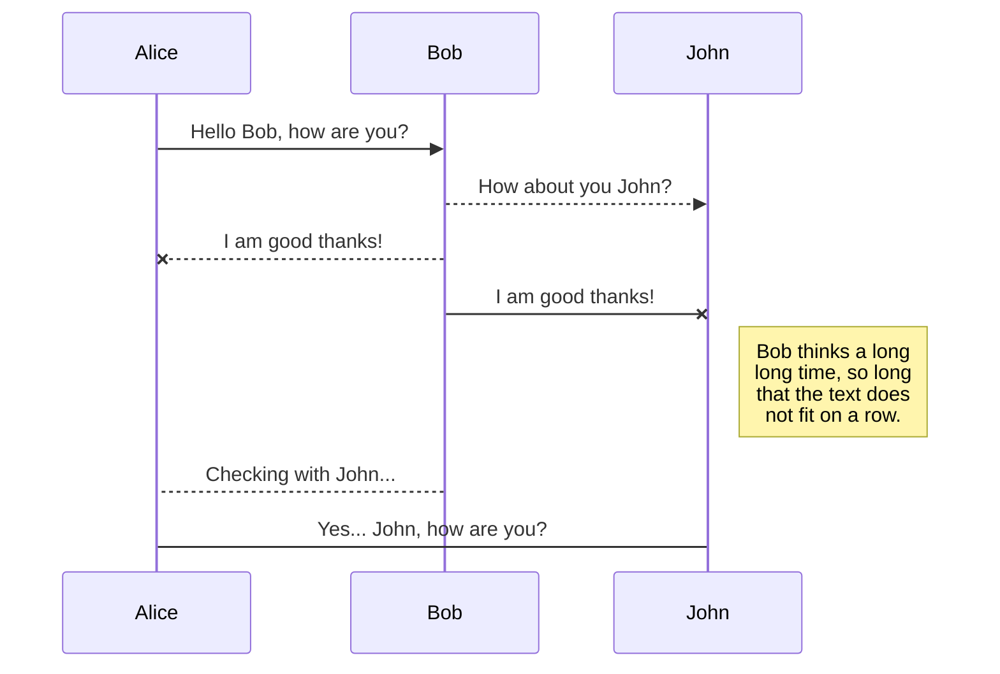
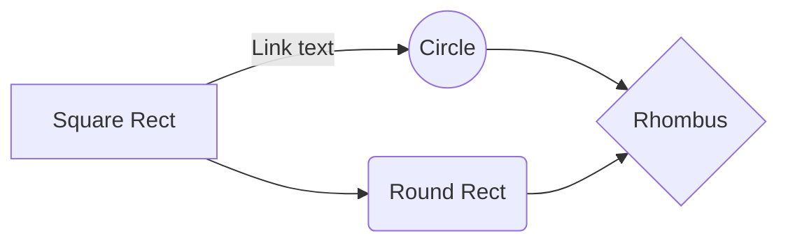

# 杨亚宇（Yayu Yang)
E-mail:yyyangsjtu@163.com；yangyayu@shmtu.edu.cn

博士，讲师/硕士生导师

电气工程专业，上海海事大学

上海浦东新区海港大道1550号

# Experience
2021.05-至今         上海海事大学电气工程专业，讲师

2018.06-2021.05      中泰证券研究所科技组，TMT行业证券分析师

2013.09-2018.06      上海交通大学电子信息与电气工程学院电气工程系，博士（导师：邰能灵教授）

2009.09-2013.06      西南交通大学电气工程学院电气工程及其自动化专业电力系统及其自动化方向，学士（导师：王晓茹教授）

# Honors and Awards
1)2023年入选上海市青年科技英才扬帆计划

2)2022年入选上海高校青年教师培养资助计划（重点推荐）

3)第十八届新财富最佳分析师评选-计算机行业入围团队核心成员

4)第十一届中国证券业分析师金牛奖-最佳计算机行业分析团队第四名团队核心成员

5)第二届新浪财经金麒麟最佳分析师评选-计算机行业第五名团队核心成员

6)2017年上海交通大学博士生国家奖学金

# Services
首届长三角全球科创项目集中路演暨“2019中国·嘉兴航空航天百人会”评委

中国证券业协会证券投资咨询(分析师)

远川研究所智库支持成员

# Reviewer
IEEE Transactions on Power Delivery、IEEE Transactions on Industrial Informatics、IET Generation, Transmission & Distribution、IET Renewable Power Generation、International Transactions on Electrical Energy Systems、Protection and Control of Modern Power Systems、IEEE Access、IETE Journal of Research、电工技术学报、上海交通大学学报等国内外期刊

# Research Interests
电力系统自动化：电力系统继电保护、直流输配电系统、船舶电力系统等。
证券投资分析。

# Projects
上海市“科技创新行动计划”启明星项目（扬帆专项），船舶电力系统保护领域，项目时间：2023.03 -2026.03，主持；

南方电网广西电力公司管理创新项目，岸电电力系统领域,项目时间：2023.07 -2024.07，主持；

电力传输与功率变换控制教育部重点实验室开放课题，HVDC输电线路保护领域，项目时间：2022.10 -2024.02，主持；

上海高校青年教师培养资助计划（重点推荐），电气工程学科建模仿真领域，项目时间：2023.01-2024.12，主持。

# Publications
已发表学术论文10余篇，已授权国家发明专利5项。已发表科技行业分析报告154篇，其中科技产业趋势和投资分析深度报告44篇，数十篇科技产业研究报告被新浪网、搜狐网、凤凰网、澎湃新闻、网易、亿欧网、东方财富网、虎嗅网、36Kr、创业邦等转载。国内外顶级投资机构科技行业研究课题80个（保密不公开）。

## A-Academic Publications
### A1-SCI论文
[1]**Yayu Yang**, Nengling Tai, Yu Liu, Xiaodong Zheng, Jianjun Ma, Jun Yan, Shu Ye. Calculated DC resistance-based pilot protection scheme for bipolar HVDC transmission lines[J]. IET Generation, Transmission & Distribution, 2022, 16(20): 4027-4039. (SCI收录)

[2]**Yayu Yang**, Nengling Tai, Chunju Fan, Lian Yang, Shi Chen. Resonance frequency-based protection scheme for UHVDC transmission lines[J]. IET Generation, Transmission & Distribution, 2018, 12(2): 318-327. (SCI收录)

[3]**Yayu Yang**, Nengling Tai, Chunju Fan, Liu Jian, Miao Chen. A Particular AC Component Protection Scheme for Bipolar HVDC Transmission Lines[J]. IEEJ Transactions on Electrical and Electronic Engineering , 2018, 13(5): 732-741. (SCI收录)

[4]Shu Ye; Feng Zhang; Fei Gao; Zhongzheng Zhou; **Yayu Yang**. Fault Diagnosis for Multilevel Converters Based on an Affine-Invariant Riemannian Metric Autoencoder[J]. IEEE Transactions on Industrial Informatics, 2022, Early Access, doi: 10.1109/TII. 2022.3186992. (SCI收录)

[5]Jian Liu, Negnling Tai, Chunju Fan, **Yayu Yang**. Transient measured impedance-based protection scheme for DC line faults in ultra high-voltage direct-current system[J]. IET Generation, Transmission & Distribution, 2016, 10(14): 3597-3609. (SCI收录)

### A2-《中国电机工程学报》等学报论文
[1]**杨亚宇**,邰能灵,范春菊,刘琦,陈金祥.利用峰值频率的高压直流输电线路纵联保护方案[J].中国电机工程学报,2017,37(15):4304-4314+4570. (EI收录，电气工程学科顶刊) 

[2]**杨亚宇**,邰能灵,刘剑,郑晓冬.利用边界能量的高压直流线路纵联保护方案[J].中国电机工程学报,2015,35(22):5757-5767. (EI收录，电气工程学科顶刊)

[3]**杨亚宇**,邰能灵,谢卫,郑晓冬,马建军.利用单端边界能量的直流输电线路全线速动保护[J/OL]．电工技术学报. https://doi.org/10.19595/j.cnki.1000-6753.tces.211994 (EI收录)

[4]**杨亚宇**,邰能灵,范春菊,刘剑.基于计算电阻的高压直流输电线路纵联保护[J]. 电工技术学报, 2017, 32(7): 84-94. (EI收录)

[5]马建军，朱淼，**杨亚宇**，杜炤鑫．适用于多工作模式Buck-Boost 变换器的线性变参数模型与宽运行范围控制[J/OL]．中国电机工程学报. https://kns.cnki.net/kcms/detail/11.2107.TM.20221025.0933.003.html (EI收录，电气工程学科顶刊)

### A3-其他EI论文

### A4-国际会议论文
[1]**Yayu Yang**, Nengling Tai, Chunju Fan, Xiaodong Zheng, Jian Liu, Bin Lv. Novel transient current-based protection scheme for DC line faults in UHVDC system[C]．IEEE Power & Energy Society General Meeting, CHICAGO, USA, 2017:1-6. (EI收录)

### A5-其他论文
[1]刘月贤,王天钰,**杨亚宇**,王晓茹.电动汽车充放电系统建模与仿真[J].电力系统保护与控制,2014,42(13):70-76. (EI收录)

[2]张林,邰能灵,刘剑,**杨亚宇**,王彦虹.直流微电网方向纵联保护方法研究[J].电测与仪表,2018,55(20):1-7. (中文核心期刊)

[3]陈金熠,冯宇虹,袁晨,宁连营,**杨亚宇**,郑晓冬. 分布式能源接入电网电能质量问题研究[C].2017智能电网信息化建设研讨会论文集,2017:336-339+348.

A6-发明专利
[1]**杨亚宇**,邰能灵,黄文焘,张林,魏旭,王康安,贺杨烊,肖正光.直流输电线路单端量快速保护方法, 2021年申请, 中国国家发明专利,. ZL202111546132.0 (已进入实质审查)

[2]**杨亚宇**,邰能灵,范春菊,郑晓冬,黄文焘.基于特定频段电流的特高压直流线路保护方法, 2019-4-5, 中国国家发明专利, ZL201810115548.9(已授权)

[3]**杨亚宇**,邰能灵,范春菊,刘剑.基于边界能量的高压直流线路纵联保护方法, 2017-4-19, 中国国家发明专利, ZL201410620596.5 (已授权)

[4]**杨亚宇**,邰能灵,郑晓冬,范春菊.基于故障直流分量的高压直流线路纵联保护方法, 2017-10-3, 中国国家发明专利, ZL201510744155.0 (已授权)

[5]刘剑,邰能灵,范春菊,**杨亚宇**,郑晓冬.基于频带测量阻抗的特高压直流线路故障判别方法, 2018-7-27, 中国国家发明专利, ZL201610227884.3(已授权)

[6]刘剑,邰能灵,范春菊,**杨亚宇**,陈实.电流相关性的柔性高压直流线路保护方法, 2018-9-21, 中国国家发明专利, ZL201610223498.7(已授权)

[7]蔡彩霞,甘文洋,**杨亚宇**,郭燚,姚刚.一种用于无线中继通信系统的资源优化分配方法, 2022年申请, 中国国家发明专利,. ZL202210991693. X (已进入实质审查)

# Files

StackEdit stores your files in your browser, which means all your files are automatically saved locally and are accessible **offline!**

## Create files and folders

The file explorer is accessible using the button in left corner of the navigation bar. You can create a new file by clicking the **New file** button in the file explorer. You can also create folders by clicking the **New folder** button.

## Switch to another file

All your files and folders are presented as a tree in the file explorer. You can switch from one to another by clicking a file in the tree.

## Rename a file

You can rename the current file by clicking the file name in the navigation bar or by clicking the **Rename** button in the file explorer.

## Delete a file

You can delete the current file by clicking the **Remove** button in the file explorer. The file will be moved into the **Trash** folder and automatically deleted after 7 days of inactivity.

## Export a file

You can export the current file by clicking **Export to disk** in the menu. You can choose to export the file as plain Markdown, as HTML using a Handlebars template or as a PDF.

# Synchronization

Synchronization is one of the biggest features of StackEdit. It enables you to synchronize any file in your workspace with other files stored in your **Google Drive**, your **Dropbox** and your **GitHub** accounts. This allows you to keep writing on other devices, collaborate with people you share the file with, integrate easily into your workflow... The synchronization mechanism takes place every minute in the background, downloading, merging, and uploading file modifications.

There are two types of synchronization and they can complement each other:

- The workspace synchronization will sync all your files, folders and settings automatically. This will allow you to fetch your workspace on any other device.
	> To start syncing your workspace, just sign in with Google in the menu.

- The file synchronization will keep one file of the workspace synced with one or multiple files in **Google Drive**, **Dropbox** or **GitHub**.
	> Before starting to sync files, you must link an account in the **Synchronize** sub-menu.

## Open a file

You can open a file from **Google Drive**, **Dropbox** or **GitHub** by opening the **Synchronize** sub-menu and clicking **Open from**. Once opened in the workspace, any modification in the file will be automatically synced.

## Save a file

You can save any file of the workspace to **Google Drive**, **Dropbox** or **GitHub** by opening the **Synchronize** sub-menu and clicking **Save on**. Even if a file in the workspace is already synced, you can save it to another location. StackEdit can sync one file with multiple locations and accounts.

## Synchronize a file

Once your file is linked to a synchronized location, StackEdit will periodically synchronize it by downloading/uploading any modification. A merge will be performed if necessary and conflicts will be resolved.

If you just have modified your file and you want to force syncing, click the **Synchronize now** button in the navigation bar.

> **Note:** The **Synchronize now** button is disabled if you have no file to synchronize.

## Manage file synchronization

Since one file can be synced with multiple locations, you can list and manage synchronized locations by clicking **File synchronization** in the **Synchronize** sub-menu. This allows you to list and remove synchronized locations that are linked to your file.

# Publication

Publishing in StackEdit makes it simple for you to publish online your files. Once you're happy with a file, you can publish it to different hosting platforms like **Blogger**, **Dropbox**, **Gist**, **GitHub**, **Google Drive**, **WordPress** and **Zendesk**. With [Handlebars templates](http://handlebarsjs.com/), you have full control over what you export.

> Before starting to publish, you must link an account in the **Publish** sub-menu.

## Publish a File

You can publish your file by opening the **Publish** sub-menu and by clicking **Publish to**. For some locations, you can choose between the following formats:

- Markdown: publish the Markdown text on a website that can interpret it (**GitHub** for instance),
- HTML: publish the file converted to HTML via a Handlebars template (on a blog for example).

## Update a publication

After publishing, StackEdit keeps your file linked to that publication which makes it easy for you to re-publish it. Once you have modified your file and you want to update your publication, click on the **Publish now** button in the navigation bar.

> **Note:** The **Publish now** button is disabled if your file has not been published yet.

## Manage file publication

Since one file can be published to multiple locations, you can list and manage publish locations by clicking **File publication** in the **Publish** sub-menu. This allows you to list and remove publication locations that are linked to your file.

# Markdown extensions

StackEdit extends the standard Markdown syntax by adding extra **Markdown extensions**, providing you with some nice features.

> **ProTip:** You can disable any **Markdown extension** in the **File properties** dialog.

## SmartyPants

SmartyPants converts ASCII punctuation characters into "smart" typographic punctuation HTML entities. For example:

|                |ASCII                          |HTML                         |
|----------------|-------------------------------|-----------------------------|
|Single backticks|`'Isn't this fun?'`            |'Isn't this fun?'            |
|Quotes          |`"Isn't this fun?"`            |"Isn't this fun?"            |
|Dashes          |`-- is en-dash, --- is em-dash`|-- is en-dash, --- is em-dash|

## KaTeX

You can render LaTeX mathematical expressions using [KaTeX](https://khan.github.io/KaTeX/):

The *Gamma function* satisfying $\Gamma(n) = (n-1)!\quad\forall n\in\mathbb N$ is via the Euler integral

$$
\Gamma(z) = \int_0^\infty t^{z-1}e^{-t}dt\,.
$$

> You can find more information about **LaTeX** mathematical expressions [here](http://meta.math.stackexchange.com/questions/5020/mathjax-basic-tutorial-and-quick-reference).

## UML diagrams

You can render UML diagrams using [Mermaid](https://mermaidjs.github.io/). For example, this will produce a sequence diagram:

And this will produce a flow chart:

